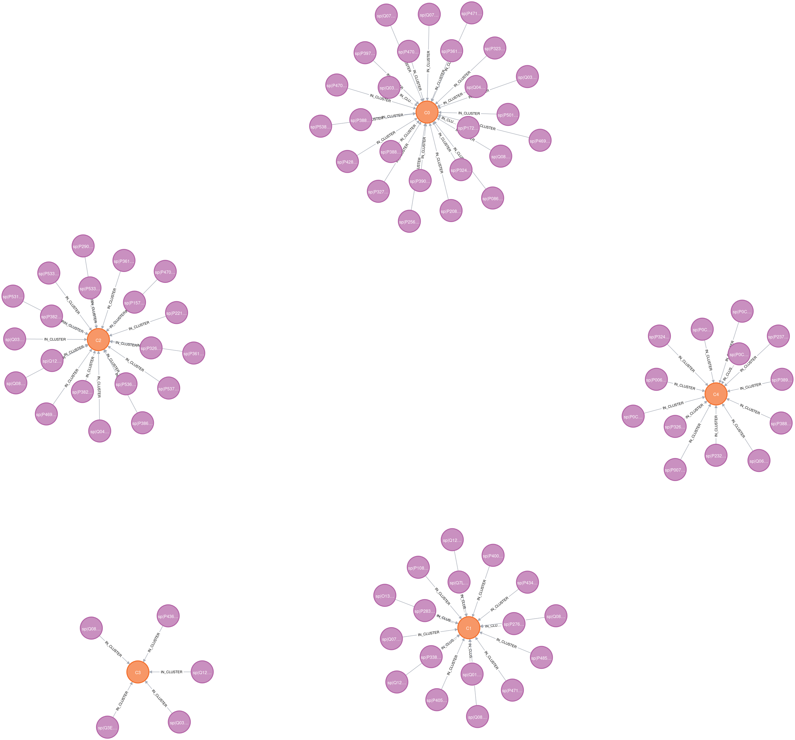
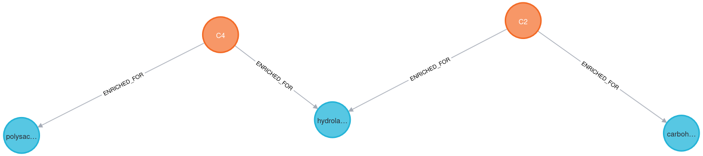
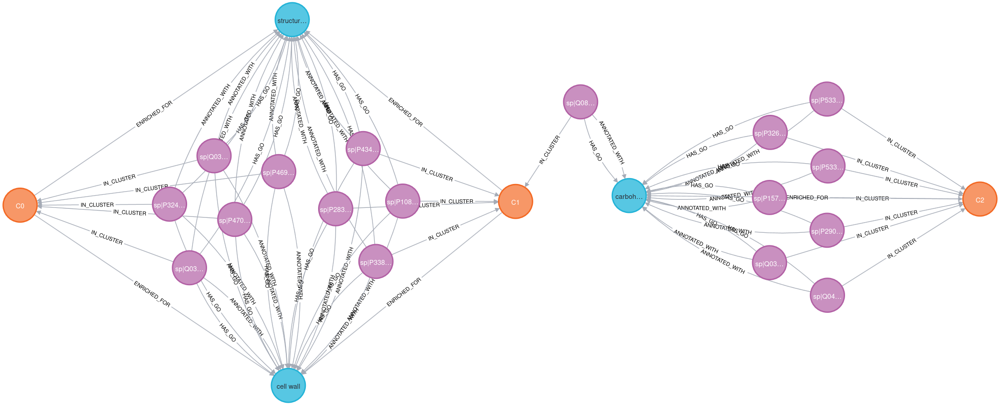

# Knowledge graph-based Functional Inference of Secreted Fungal Enzymes Using Protein Language Model Embeddings


**A knowledge graph of secreted fungal proteins integrating protein language model embeddings, domain annotations, and functional ontology data.**

---

## 🚀 Project Overview

This project demonstrates the construction of a **knowledge graph (KG)** for the **fungal secretome**, with the goal of linking **protein sequences → embeddings → clusters → functional annotations (GO terms)**. It showcases capabilities in:

- **Bioinformatics preprocessing**: secretome prediction, domain annotation  
- **Protein embeddings**: ESM embeddings for sequence similarity  
- **Functional enrichment**: GO term enrichment per protein cluster  
- **Knowledge graph construction**: ingesting into Neo4j for visualization and exploration  

This KG allows **exploration of functional patterns, cluster relationships, and protein similarity networks**.

The long-term goal is to establish a validated pipeline that can be applied to less well-characterized fungi (e.g. oyster and reishi mushrooms) relevant to biomaterials and mycelium-based construction, where secreted enzymes play a critical structural and biochemical role.

---

## 🧠 Why Yeast? Why the Secretome?

**Why Saccharomyces cerevisiae?**
- A gold-standard fungal model organism
- Extensive Pfam and GO annotation coverage
- Enables validation of embedding-based methods against known biology

Using yeast allows us to ask:
**Do unsupervised sequence embeddings recover known functional structure without using annotations during clustering?**

**Why the secretome?**

Secreted proteins were chosen because they:

- Are functionally enriched (enzymes, cell wall modifiers, polysaccharide metabolism)
- Directly mediate extracellular structure and remodeling
- Are highly relevant to fungal biomass, material properties, and environmental interaction

For mycelium-based materials, the secretome represents the functional interface governing growth, adhesion, and structural integrity.


## 🧬 Dataset

- Protein sequences for *S. cerevisiae* (secretome subset)
- SignalP-5.0 predictions for secretion  
- Pfam domain annotations  
- GO term mappings (via `pfam2go`)  
- ESM protein language model embeddings


**Processed files** (stored in `/data/processed`):

- `yeast_protein_go.tsv` → protein → GO mapping  
- `yeast_protein_clusters.tsv` → protein → cluster mapping  
- `yeast_cluster_go_enrichment.tsv` → cluster → enriched GO terms  
- `yeast_secreted_esm2.npz` → ESM protein embeddings  

---

## ⚙️ Workflow

1. **Secreted protein prediction**  
   - Run SignalP on raw sequences  
   - Filter proteins predicted as secreted

2. **Protein embeddings**  
   - Compute ESM embeddings  
   - Save as `.npz` for clustering

3. **Pfam domain annotation**  
   - Map proteins to Pfam domains  
   - Map Pfam domains to GO terms (`pfam2go`)  
   - Create `yeast_protein_go_secretome.tsv`

4. **Clustering**  
   - Cluster ESM embeddings (KMeans, k=5)  
   - Save protein → cluster mapping

5. **GO enrichment analysis**  
   - Compute per-cluster GO enrichment  
   - Save results (`yeast_cluster_go_enrichment.tsv`)

6. **Knowledge graph construction in Neo4j**  
   - Nodes: `Protein`, `Cluster`, `GO`  
   - Relationships:  
     - `:IN_CLUSTER` → Protein → Cluster  
     - `:HAS_GO` → Protein → GO  
     - `:ENRICHED_FOR` → Cluster → GO  
   - Optional: future cross-species expansion

---

## 📊 Key Visualizations & Insights

**Embedding-based protein clusters**

Protein language model embeddings form **cohesive clusters** despite no functional labels being used during clustering, indicating that sequence alone captures meaningful structure.

--- 

**Functional enrichment of clusters**

Only a subset of clusters shows statistically significant GO enrichment, reflecting both:
- Well-annotated functional modules
- Potentially under-characterized or emergent sequence-driven structure not fully captured by GO

---

**Functional overlap across clusters**

Proteins from different embedding clusters share GO terms, revealing **functional convergence despite sequence divergence**.
Here, **GO terms act as bridges** between clusters, highlighting complementary views of protein organization.

---

## 🗂 Project Structure

```text
fungal-secretome-kg/
│
├─ data/
│ ├─ raw/ # raw sequences and pfam2go
│ └─ processed/ # TSVs for ingestion
│
├─ scripts/
│ ├─ compute_esm_embeddings.py
│ ├─ annotate_proteins_with_go.py
│ ├─ cluster_go_enrichment.py
│ └─ build_similarity_edges.py
│
├─ tools/ # SignalP binaries, ESM models
│
├─ Dockerfile / docker-compose # Neo4j setup
│
└─ README.md
```

---

## 📊 Graph Schema

**Nodes**:

| Label   | Properties                     |
|---------|--------------------------------|
| Protein | protein_id                     |
| Cluster | cluster_id                     |
| GO      | go_id, go_name                 |

**Relationships**:

| Type           | From     | To      | Properties                        |
|----------------|---------|---------|-----------------------------------|
| IN_CLUSTER      | Protein | Cluster | —                                 |
| HAS_GO          | Protein | GO      | —                                 |
| ENRICHED_FOR    | Cluster | GO      | p_value, cluster_size, go_count   |

---

## 🔍 Neo4j Visualization

## 📸 Neo4j Graph Visualizations

### Protein–Cluster Structure



*Figure 1. Proteins grouped into embedding-derived clusters. Node proximity reflects sequence similarity.*

---

### Cluster–GO Relationships



*Figure 2. Enriched GO terms shared across multiple protein clusters, revealing functional overlap.*

---

### Cross-Cluster GO Sharing



*Figure 3. Multiple clusters connecting to the same GO terms, indicating conserved functional roles.*

```cypher
MATCH (p:Protein)-[:IN_CLUSTER]->(c:Cluster)
RETURN p, c
LIMIT 25;
```
---

## 🌱 Future Work

- Expand to other fungal species (e.g. *Ganoderma*, *Pleurotus*)

- Add protein similarity edges based derived from ESM embeddings

- Identify cross-cluster proteins with shared GO annotations

- Preform cross-species cluster comparison and GO enrichment comparisons

- Interactive web-based visualization of KG

---

## 📚 References

**SignalP 5.0**
https://services.healthtech.dtu.dk/service.php?SignalP-5.0

**Pfam Database**
https://pfam.xfam.org/

**ESM Protein Language Models**
https://github.com/facebookresearch/esm

**Neo4j Graph Database**
https://neo4j.com/
